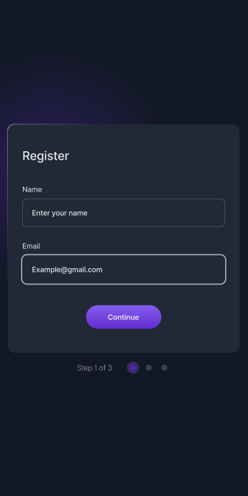

# Multi-step Register Form

A modern, responsive multi-step registration form built with HTML, CSS, and JavaScript. This project is a solution to the devChallenges.io Multi-step Register Form challenge.


## Features

- Three-step registration process:
  1. User details (name, email)
  2. Topic selection (checkboxes)
  3. Summary and confirmation
- Responsive design for desktop and mobile
- Professional UI with custom shadows, borders, and typography
- Accessible and keyboard-friendly navigation
- Clean, maintainable code structure


## Technologies Used

- HTML5
- CSS3 (with custom properties and media queries)
- JavaScript (vanilla, no frameworks)
- [Inter font](https://fonts.google.com/specimen/Inter) for modern typography

## Getting Started

1. Clone or download this repository.
2. Open `index.html` in your preferred browser.
3. No build steps or dependencies required.

## Folder Structure

```
├── index.html
├── README.md
├── thumbnail.jpg
├── design/
│   ├── Desktop_1350px-1.jpg
│   ├── ...
├── resources/
│   ├── blur-radial.png
│   ├── favicon.ico
```

## Customization

- To change the author info, edit the `.author-info` section in `index.html`.
- To adjust the form steps or add fields, modify the form markup and related JavaScript.
- Colors, fonts, and spacing can be tweaked in the `<style>` section of `index.html`.

## Screenshots

Here are some screenshots of the form in action:

| Desktop | Tablet | Mobile |
|---------|--------|--------|
|  |  |  |

## Accessibility

This project follows accessibility best practices:
- Proper label associations for form fields
- Keyboard navigation support
- Sufficient color contrast
- Focus indicators for interactive elements


## Author

- Challenge by [devChallenges.io](https://devchallenges.io/)
- Coded by Ayokanmi Adejola
